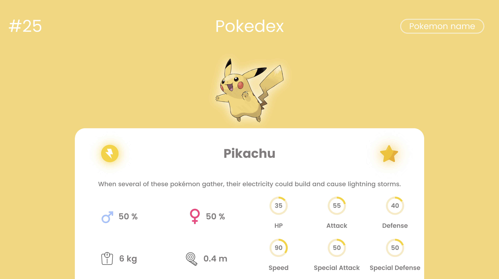

# Pokedex
A pokedex where you can search for your favorite pokemons fast and easy. Now you can have your favorite pokemons on your hand. 
## Download
The final version is expected for late 2023.
If you want to try it on dev phase.

```
    git clone <repository>
    go to the folder
    php -S localhost:9000
```


## Preview of Pokedex

## Technologies used.
  ### Frontend
  
  
  
  ### Backend
   
    
## User Stories
  1. As an user i want to search for a pokemon and see itś stats. (Done)
  2. As an user i want to be able to have a favorite pokemon list.
  3. As an user I want to have a settings where i can change my info.
  4. As an user I want to get easy access to pokemon evolutions.(In progress)
  5. As an user I want to get pop up messages if i update something.
  6. As an user I want to be able to buy pokemons in a marketplace like a game.
  7. As an user I want to feel the most secure possible.
## Project phases
- [ ] Main features
- [ ] Refactoring and Clean Code
- [ ] Testing
- [ ] Documentation
- [ ] Deploy
## API
I used PokeApi for this project.
https://pokeapi.co/
## Datasets
The images of Pokemons can be found https://www.kaggle.com/datasets/arenagrenade/the-complete-pokemon-images-data-set
